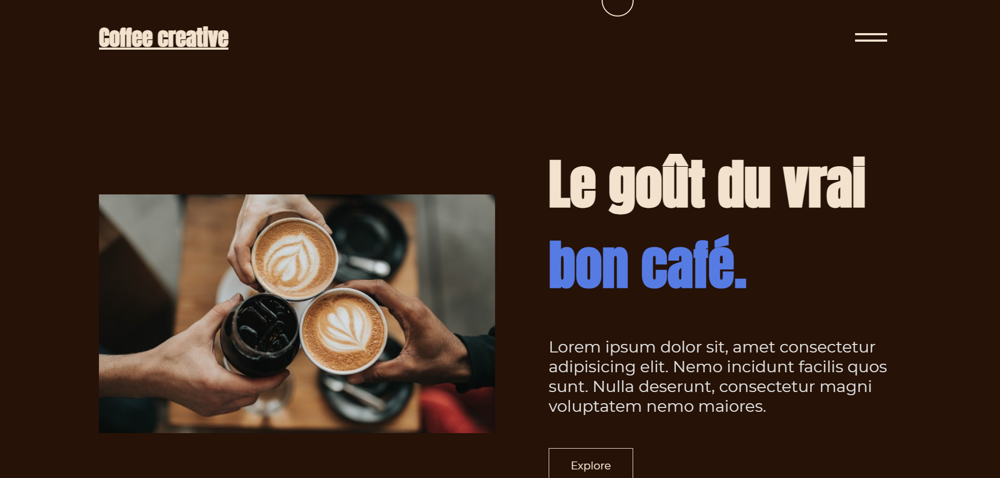

<div id="top"></div>

[](https://bouzid-krita.com)
[](https://codepen.io/bouboudev)
[](https://twitter.com/intent/follow?original_referer=https%3A%2F%2Fgithub.com%2Fboubou_dev&screen_name=boubou_dev)
[](https://www.linkedin.com/in/bouzidkrita/)


<!-- PROJECT LOGO -->
<br />
<div align="center">
    
  <h2 align="center">Coffee creative</h>

  <p align="center">
  it's a website coffee creative!
    <br />
   
  </p>
</div>

<!-- TABLE OF CONTENTS -->
<details>
  <summary>Table of Contents</summary>
  <ol>
    <li>
      <a href="#about-the-project">About The Project</a>
      <ul>
        <li><a href="#built-with">Built With</a></li>
      </ul>
    </li>
    <li>
      <a href="#getting-started">Getting Started</a>
      <ul>
        <li><a href="#installation">Installation</a></li>
      </ul>
    </li>
    <li><a href="#license">License</a></li>

  </ol>
</details>


<!-- ABOUT THE PROJECT -->
## About The Project


<br />
<br />

The goal of the project was to create a website with several javascript animations.


<p align="right">(<a href="#top">back to top</a>)</p>


### Built With


* [HTML](https://developer.mozilla.org/en-US/docs/Web/HTML)
* [CSS](https://developer.mozilla.org/en-US/docs/Web/CSS)
* [JAVASCRIPT](https://developer.mozilla.org/en-US/docs/Web/JavaScript)


<p align="right">(<a href="#top">back to top</a>)</p>


<!-- GETTING STARTED -->
## Getting Started

### Installation


1. Clone the repo
   ```sh
   git clone https://github.com/bouboudev/backtobasics.git
   ```
2. Double Click on index.html
3. Have fun
  


<p align="right">(<a href="#top">back to top</a>)</p>


<!-- LICENSE -->
## License

Distributed under the MIT License. See `LICENSE.txt` for more information.

<p align="right">(<a href="#top">back to top</a>)</p>


